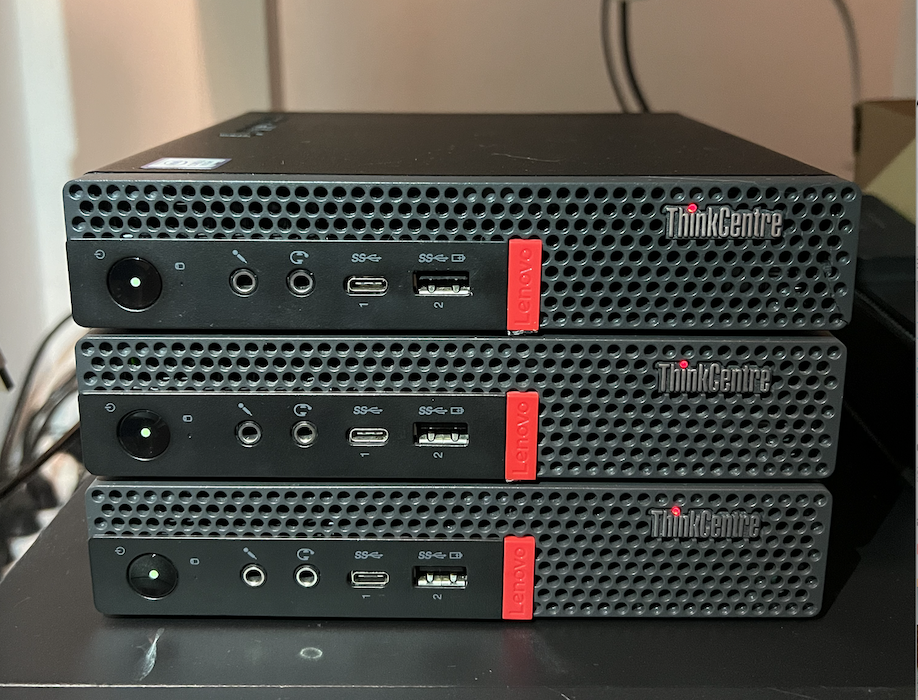

## 📖 &nbsp; Overview

Just a learning project for setting up a Kubernetes Cluster with tools like Ansible, Terraform, and so on.

## 🔧 &nbsp; Hardware

| Device                        | OS Disk Size | Data Disk Size            | CPU      | Ram  | Purpose             |
| ----------------------------- | ------------ | ------------------------- | -------- | ---- | ------------------- |
| Lenovo M720q                  | 256 GB SSD   | 1 TB Samsung 980 NVMe     | i3-8100T | 16GB | k3s master & worker |
| Lenovo M720q                  | 256 GB SSD   | 1 TB Samsung 980 Pro NVMe | i3-8100T | 16GB | k3s master & worker |
| Lenovo M720q                  | 256 GB SSD   | 1 TB Samsung 980 NVMe     | i3-8100T | 8GB  | k3s master & worker |
| Custom Server Fujitsu D3644-B | 128 GB SSD   | 2 x 256 SSD, 3 x 6 TB HDD | i3-8100  | 64GB | TrueNAS Scale       |

## 💾 &nbsp; Storage

## 🌐 &nbsp; Network

## ☢️ &nbsp; Nuke Counter: 1

  
1

  ### What happened?
  I attempted to configure [Split DNS](https://en.wikipedia.org/wiki/Split-horizon_DNS) using two ingress-nginx controllers: one for internal requests and another for those coming over Cloudflare IPs. To cut a long story short, I severely misconfigured my pi-hole, OpenWrt, and Cilium settings.

  ### What did I learn?
  One genius guy explaining it very well and convincing me that I absolutely need it does not necessarily mean that I need it right now.

  Keep it simple! Use WireGuard over OCI until I decide to make anything publicly available.

